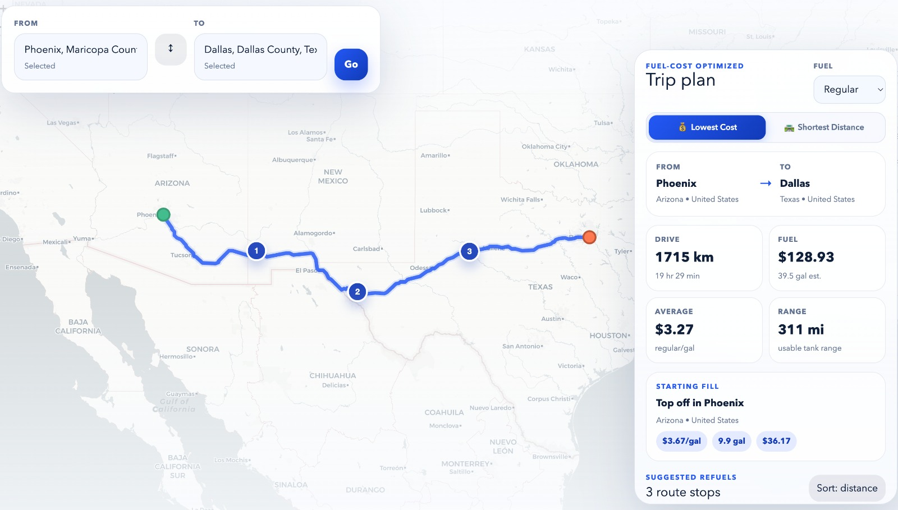

# Fuel-Aware Route Optimizer

A trip planner that finds the cheapest fuel stops along your route — not just the shortest path.



## What it does

Enter an origin and destination, pick your fuel type, and the app calculates a driving route with optimized refueling stops. You can toggle between **Lowest Cost** (minimizes total fuel spend) and **Shortest Distance** (fewest detours). The sidebar shows a full trip plan: drive distance, estimated fuel cost, average price, tank range, and each suggested stop with per-gallon pricing.

## How it works

- **Routing** — TomTom APIs for geocoding, place search, and turn-by-turn driving routes.
- **Fuel prices** — EIA (U.S. Energy Information Administration) state-level price data for regular, midgrade, premium, and diesel.
- **Optimization** — Three algorithms compete to find the best refueling strategy:
  - Greedy cheapest-first
  - Dijkstra over a fuel-stop graph
  - A\* with fuel-cost heuristic

The backend picks the plan with the lowest total cost (or shortest distance, depending on mode) and returns it.

## Stack

| Layer    | Tech |
|----------|------|
| Frontend | Next.js 16, React 19, Leaflet, Tailwind CSS |
| Backend  | FastAPI, Pydantic v2, Uvicorn |
| APIs     | TomTom (routing + places), EIA (fuel prices) |

## Setup

### 1. API keys

```bash
cd fastapi
cp .env.example .env
# add your EIAKEY and TOMTOM_KEY
```

### 2. Backend

```bash
cd fastapi
pip install -r requirements.txt
uvicorn main:app --reload --port 5001
```

### 3. Frontend

```bash
cd frontend
npm install
npm run dev
```

The frontend runs on `localhost:3000` and talks to the backend on `localhost:5001`.

## License

This project was built as a capstone for [AtoB](https://www.atob.com/). Source code is provided for viewing and reference only and NOT licensed for reproduction or commercial use.
